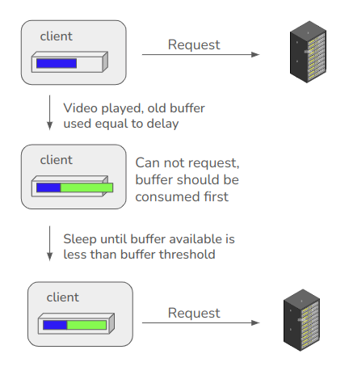

# Deadline 
6 Nov 2024

# Introduction
- In this assignment, you need to write bit-rate adaptation algotithm. 
- Skeleton code is provided and you need to make changes in only adapter.py. You can add your auxiliary files too. 

## Bit-rate Adaptation Algorithm
- We assume that video at the server is an array of chunks. 
- These chunks are at different resolution in **sorted order**, therefore we can consider the video data as matrix.
- Algorithm takes input the state of client and manifest.
- Client call this algorithm each time it request next chunk. Given the current state of client, the algorithm returns the index of some resolution available in bit-rate resolution.
- Client then request the chunk with the resolution returned by Adaptation algorithm.
- The aim of this assignment is to maximize the reward/QoE(Quality of Experience) of the video.
- Reward Calculation : current_resolution - rebuffering penalty * (rebuffering) - smooth_penalty * (abs(current_resolution - last_resolution))

## Simulating Video Playing
Client will calculate the delay to get a video chunk.        
Drain delay from available buffer to simulate video playing.        
If the delay is greater than avilable buffer then it will cause rebuffering, and rebuf will be max(0, delay - available buffer)

## Case when requested chunk data + available buffer can overflow buffer threshold                      

# Environments
We will use 4 different environments to test your algorithm. You can optimize for each one seperately. For each case, client will use seperate adapter written in respective classes.  
Notation for classes : 
- CC : Constant Chunk Length
- CB : Constant Bandwidth
- V : Variable

-- Channel Bandwidth in all cases will be 1000*1024 bytes/sec.      

-- Server will have 8 Resolutions which are Multiples of 125 KBytes/sec.      

-- Constant Chunk Length Size, Max Chunk Length, Penalties, Buffer Threshold are hidden for final leaderboard. 

## Constant Chunk Length, Constant Bandwidth

## Constant Chunk Length, Variable Bandwidth
To simulate the **variable bandwidth**, the topology will contain a randomized adversary which keep requesting packet of random resolution. It behaves similar to client.py except the adapter used will just return a random bitrate to be chosen.

## Variable Chunk Length, Constant Bandwidth

## Variable Chunk Length, Variable Bandwidth

# Adapter.py
It contain 4 classes. You need to implement adapt method for each class. You are free to optimize for each conditions seperately. 

# What to Submit
- Don't change the name of files.
- You just need to submit adapter.py and auxiliary files on gradescope in a zip. Note that client.py and serve.py should not be submitted.
